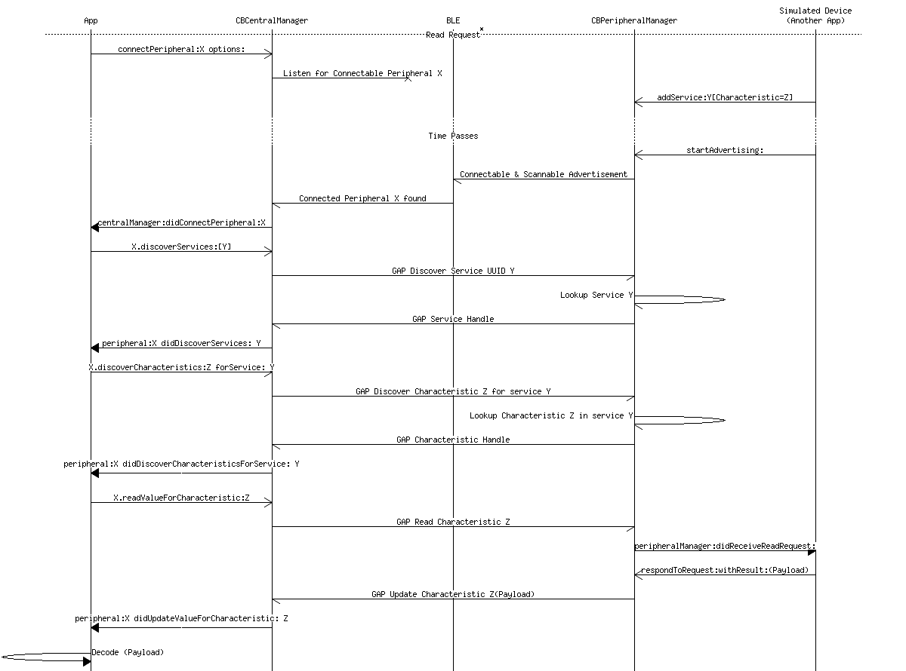
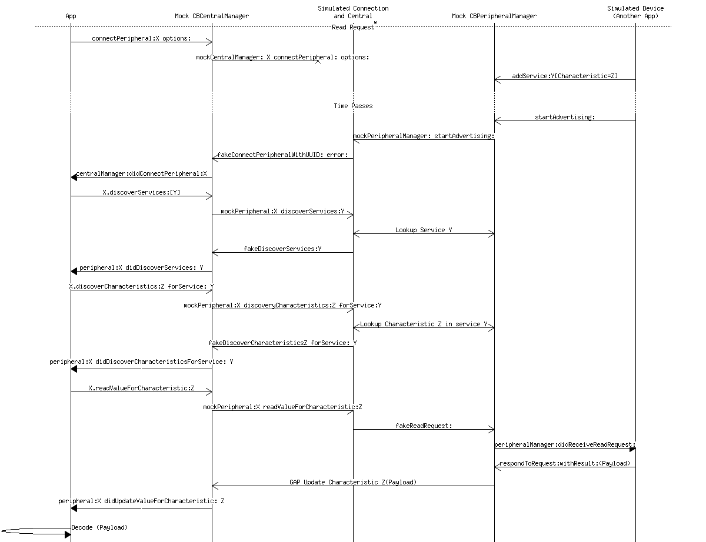

[](https://travis-ci.org/Raizlabs/RZBluetooth)
[](http://cocoapods.org/pods/RZBluetooth)
[](http://cocoapods.org/pods/RZBluetooth)
[](http://cocoapods.org/pods/RZBluetooth)

# RZBluetooth
The goal of RZBluetooth is to make Core Bluetooth easy to use and test. It provides a block based API with state management, automatic discovery, and support for public protocols. RZMockBluetooth contains a set of Core Bluetooth mock objects that enables in-app device simulation by connecting the CBCentralManager and CBPeripheralManager API's.

# Quick Start
To get a feel for RZBluetooth, the following block of code will print out the heart rate of the first heart rate monitor that comes nearby, every time a new reading is available. Also note that this code can run in your unit test target.

```objc
self.centralManager = [[RZBCentralManager alloc] init];
[self.centralManager scanForPeripheralsWithServices:@[CBUUID rzb_UUIDForHeartRateService] options:@{} onDiscoveredPeripheral:^(RZBScanInfo *scanInfo, NSError *error) {
    [self.centralManager stopScan];
    self.peripheral = scanInfo.peripheral;
    [self.peripheral rzb_addHeartRateObserver:^(RZBHeartRateMeasurement *measurement, NSError *error) {
        NSLog(@"%@", measurement);
    } completion:^(NSError *error) {
        if (error) {
            NSLog(@"Error=%@", error);
        }
    }];
}];
```

Alternatively in Swift:

```swift
centralManager = RZBCentralManager()
centralManager.scanForPeripheralsWithServices([CBUUID.rzb_UUIDForHeartRateService()], options: nil) { scanInfo, error in
    guard let peripheral = scanInfo?.peripheral else {
        print("ERROR: \(error!)")
        return
    }
    self.centralManager.stopScan()
    peripheral.addHeartRateObserver({ measurement, error in
        guard let heartRate = measurement?.heartRate else { return }
        print("HEART RATE: \(heartRate)")
    }, completion: { error in
        guard let error = error else { return }
        print("ERROR: \(error)")
    })
}
```

This block will wait for bluetooth to power on and scan for a new peripheral supporting the heart rate service. When one is found, the app will connect to the peripheral, discover the heart rate service and observe the characteristic. When the characteristic is notified, the `NSData*` object is serialized into a more developer friendly object.

# Install
RZBluetooth is available through CocoaPods. To install it, add the following line to your Podfile:

```ruby
pod 'RZBluetooth'
```

# Block Based API

RZBluetooth exposes a block based API for reading, writing, and being notified of changed values.

```obj-c
RZBPeripheral *peripheral = [self.centralManager peripheralForUUID:uuid];
[peripheral readCharacteristicUUID:[CBUUID rzb_UUIDForBatteryLevelCharacteristic]
                       serviceUUID:[CBUUID rzb_UUIDForBatteryService]
                        completion:^(CBCharacteristic *characteristic, NSError *error) {
                                   NSData *valueIActuallyWant = characteristic.value;
                        }];

[self enableNotifyForCharacteristicUUID:[CBUUID rzb_UUIDForBatteryLevelCharacteristic]
                            serviceUUID:[CBUUID rzb_UUIDForBatteryService]
                               onUpdate:^(CBCharacteristic *characteristic, NSError *error) {
                                   // New value is notified by the peripheral
                           } completion:^(CBCharacteristic *characteristic, NSError *error) {
                                   // Notification has been configured
                           }];
```

Internally, RZBluetooth uses a command pattern to simplify the delegate management.

 - The peripheral is automatically connected if it is not connected.
 - The service and characteristics are automatically discovered.
 - Multiple read and write calls will not cause more connect or discover events than required. The discover events are batched up and triggered on the next runloop iteration.


This hides a lot of the delegate callback pain. Commonly in Core Bluetooth implementations, the delegate callbacks cause tight coupling between different services. This makes writing re-usable code very challenging. The command pattern loosens up that coupling to allow different bluetooth services to be developed and supported in isolation. This enables the development of Service level APIs which can be developed and supported in the same code base, even if the peripheral does not support the service.


# Service Level APIs
Developers connecting to Bluetooth devices do not want to read and write `NSData` blobs. Developers want to interact with expressive API's with real model objects that encapsulate the domain knowledge of the services and characteristics. RZBluetooth comes with APIs for many of the standard bluetooth services. These provide a pattern for developers to extend RZBluetooth to support their own proprietary service.

```objc
- (void)exampleOperations
{
    RZBPeripheral *peripheral = [self.centralManager peripheralForUUID:uuid];
    [peripheral rzb_addBatteryLevelObserver:^(NSUInteger batteryLevel, NSError *error) {
        // Update UI for the battery level.
    } completion:^(NSError *error) {
        // Completion indicating that the battery monitor has been set up.
    }];
    [peripheral rzb_readSensorLocation:^(RZBBodyLocation location) {
    }];
    [peripheral rzb_addHeartRateObserver:^(RZBHeartRateMeasurement *measurement, NSError *error) {
    } completion:^(NSError *error) {
    }];
}
```

# Error Handling
All Core Bluetooth errors passed through to the client, however RZBluetooth adds a handful of errors to help clarify some state corner cases.

## CBCentralManagerState
If an action is performed and the central is in a "terminal" state, an error with an error code of `RZBluetooth[Unsupported|Unauthorized|PoweredOff]` will be generated. If the state is Unknown or Resetting, RZBluetooth will wait for the state to become powered on before sending the commands, or will fail the command with an appropriate error.

## Un-Discoverable Services and Characteristics
If an action is performed on a peripheral and the service or characteristic does not exist, an error object will be generated to clearly state the failure scenario. Both `RZBluetoothDiscoverServiceError` and `RZBluetoothDiscoverCharacteristicError` will have a userInfo dictionary with the key `RZBluetoothUndiscoveredUUIDsKey` populated with the undiscovered UUIDs.

## User Initiated Timeout
If an action is performed with `RZBUserInteraction` enabled, and the action takes longer than the timeout, the command will fail, and the completion block will be triggered with an error object. The error code will be `RZBluetoothTimeoutError`.

# Bluetooth Usage Patterns
There are a few patterns of behavior that most Bluetooth applications use:

1. Scanning for peripherals that the application can interact with.
2. Availability Interactions with a known peripheral.
3. User interaction with a known peripheral.

## Scanning
Scanning for new peripherals is usually a user-initiated action that collects all nearby devices, and allows the user to confirm the device they want to interact with. Be sure to specify the UUID of the required service.

Think through the UX of your application:

1. Prompt the user to perform any required device action to make the device appear. Most heart rate monitors will not be discoverable unless they are worn.
2. Do you need a list of nearby devices to select from? Can you tell the user that too many devices were found and the other devices should be turned off?
3. If there are multiple devices, how does the user ensure the proper device is selected?
4. What type of security is used? Initiate the SSN pairing process by reading or writing a secured property before completing selection.

Once a device has been selected, the peripheral UUID can be persisted between application starts. Also, it's important to note that the peripheral UUID is unique to the iOS device and should not be shared between computers.


## Availability Interactions
Availability Interactions are a set of actions that should be performed every time the device becomes available. Device Sync is usually built on top of this. RZBPeripheral provides a connection delegate to help manage these sorts of interactions.

```objc
    peripheral.connectionDelegate = self
    peripheral.maintainConnection = YES;
}

//
- (void)peripheral:(RZBPeripheral *)peripheral connectionEvent:(RZBPeripheralStateEvent)event error:(NSError *)error;
{
    if (event == RZBPeripheralStateEventConnectSuccess) {
        // perform any connection set up here that should occur on every connection
    }
    else {
        // The device is disconnected. maintainConnection will attempt a connection event
	// immediately after this. This default maintainConnection behavior may not be
	// desired for your application. A backoff timer or other behavior could be
	// implemented here.
    }
}

```
Usually all transport layer errors should be ignored, and most other errors would be considered fatal.

## User Interactions
Core Bluetooth and RZBluetooth actions do not timeout by default. User initiated actions however do need to timeout so the UI can inform the user that there's an issue. This behavior can be easily enabled via the `RZBUserInteraction` object:

```objc
[RZBUserInteraction setTimeout:5.0];
[RZBUserInteraction perform:^{
    [self.peripheral rzb_fetchBatteryLevel:^(NSUInteger level, NSError *error) {
        // The error object could have status code RZBluetoothTimeoutError
    }];
}];
```

## Background Support
RZBluetooth will specify a `CBCentralManagerOptionRestoreIdentifierKey` if the application has `bluetooth-central` specified in the background mode. This key will cause the application to be restored if a connection attempt succeeds. `RZBCentralManager` has a property `restorationHandler` which is triggered when the peripherals are restored.

## Logging Support
RZBluetooth provides the ability to print log messages out that describe all of the CoreBluetooth interactions via the method `RZBSetLogHandler`. Usually this can be sent straight to NSLog, but if your application has a special logger, the integration should be simple.

## RZBPeripheral Subclass
For more complicated peripherals, it's often required to have more complex associated state and handler callbacks. If you believe a subclass will help your implementation, you can use a special initializer on `RZBCentralManager` that will create your subclass when a new peripheral is found.

# Testing
Core Bluetooth can be challenging to test. RZBluetooth comes with a library, `RZMockBluetooth`, that allows you to use mock Core Bluetooth objects to test your bluetooth and application code. Using the mock library you can fake the bluetooth device events programmatically, and the Core Bluetooth objects seen by your application will consistently manage their mocked state. All of your application code will use the same API provided by Core Bluetooth even though the objects are actually equivalent `RZBMock` objects.

For example:

```obj-c
    [self.mockCentralManager fakeStateChange:CBManagerStatePoweredOn];
    // Triggers: - (void)centralManagerDidUpdateState:(CBCentralManager *)centralManager
    // Configures: centralManager.state == CBManagerStatePoweredOn

    [self.mockCentralManager fakeDisconnectPeripheralWithUUID:identifier
                                                        error:nil];
    // Triggers: - (void)centralManager:(CBCentralManager *)central didDisconnectPeripheral:(CBPeripheral *)peripheral error:(nullable NSError *)error
    // Configures: peripheral.state = CBPeripheralStateDisconnected
```

The following mock objects are available:

|Core Bluetooth      | Mock Object                                                                 |
|--------------------|-----------------------------------------------------------------------------|
|CBCentralManager    | [RZBMockCentralManager](RZMockBluetooth/Mock/RZBMockCentralManager.h)       |
|CBPeripheral        | [RZBMockPeripheral](RZMockBluetooth/Mock/RZBMockPeripheral.h)               |
|CBPeripheralManager | [RZBMockPeripheralManager](RZMockBluetooth/Mock/RZBMockPeripheralManager.h) |

The mock objects mirror the CoreBluetooth stack and support the same public-facing API as their CoreBluetooth equivilents. All of the mock objects objects follow two patterns. When a Core Bluetooth API is invoked on the mock object, it will relay that method call out to the `mockDelegate` immediately. The mock objects also support a large number of methods with the prefix `fake`. Every one of these fake methods are associated with a delegate method on the delegate of that object. When the method is invoked, it will dispatch a delegate trigger to the objects dispatch queue.

As a developer, you can use `RZBMockCentralManager` or `RZBMockPeripheralManager`  directly, or you can use `RZBMockEnable(YES)`. This will swizzle alloc of `CBCentralManager` and `CBPeripheralManager` and return the equivolent RZBMock object instead. RZBMockCentralManager will create `RZBMockPeripheral` objects instead of `CBPeripheral` objects.

# Fake Peripheral
Another great testing strategy with Bluetooth is to implement a fake peripheral using the CBPeripheralManager API. This allows the developer to test against the same Bluetooth service while the hardware is still under development.

RZBluetooth provides a base class `RZBSimulatedDevice` to help simplify the `CBPeripheralManager` API. This object is a delegate of `CBPeripheralManager`, and provides a few helpers for working with `CBPeripheralManager`. It also provides support for some common services, like battery level, and device info. With this, a small shell of an iOS or Mac application can be written to fake this peripheral.

This may sound like a lot of effort for little pay off. But the development value here is much higher with RZBluetooth due to it's support for in-memory bluetooth simulation.

# Simulation
RZBMockBluetooth provides a few simulation objects that use the mock objects to connect the `CBCentralManager` and the `CBPeripheralManager` APIs. This allows the developer to take the fake peripheral developed above and simulate a fully functioning bluetooth stack inside the application. This also works inside the simulator, which has traditionally been useless for Core Bluetooth development. With this, the developer is able to utilize the fake peripheral inside of unit tests, or from a debug menu in the application.

## Sequence Diagrams
To help understand how simulation compares against real bluetooth usage, here is a [sequence diagram](Documentation/Read.msc) of a read using Bluetooth:



Here is a [sequence diagram](Documentation/Simulated-Read.msc) of the same read request going through simulation:



# Developing a Fake Peripheral
This section explains the steps to develop a fake peripheral with a battery service and use that peripheral inside a unit test.

## Model Bluetooth Service
The first step is to model the bluetooth service and characteristics with Core Bluetooth.

```obj-c
CBMutableService *batteryService = 
    [[CBMutableService alloc] initWithType:[CBUUID rzb_UUIDForBatteryService] primary:NO];
CBMutableCharacteristic *batteryCharacteristic = 
    [[CBMutableCharacteristic alloc] initWithType:[CBUUID rzb_UUIDForBatteryLevelCharacteristic]
                                       properties:CBCharacteristicPropertyRead | CBCharacteristicPropertyIndicate
                                            value:nil
                                      permissions:CBAttributePermissionsReadable];
batteryService.characteristics = @[batteryCharacteristic];

[self addService:batteryService];
```

This will add a battery service and characteristic with read and indication support. By specifying nil for the value, CoreBluetooth is informed that this is a dynamic value that should be supplied via callbacks. Check out [Setting Up Your Services and Characteristics](https://developer.apple.com/library/ios/documentation/NetworkingInternetWeb/Conceptual/CoreBluetooth_concepts/PerformingCommonPeripheralRoleTasks/PerformingCommonPeripheralRoleTasks.html#//apple_ref/doc/uid/TP40013257-CH4-SW3) in the [CoreBluetooth documentation](https://developer.apple.com/library/ios/documentation/NetworkingInternetWeb/Conceptual/CoreBluetooth_concepts/AboutCoreBluetooth/Introduction.html#//apple_ref/doc/uid/TP40013257-CH1-SW1) for more information.


## Handle Bluetooth Events
The next step is to handle the callbacks that CoreBluetooth triggers. This can be a read request, a write request, or a subscription change that is triggered when a characteristic is observed or un-observed. In this example, supplying a fake battery level is relatively trivial.

```obj-c
__block typeof(self) welf = (id)self;
[self addReadCallbackForCharacteristicUUID:[CBUUID rzb_UUIDForBatteryLevelCharacteristic] handler:^CBATTError (CBATTRequest *request) {
    NSNumber *batteryNumber = welf.values[RZBBatteryLevelKey];
    uint8_t batteryLevel = [batteryNumber unsignedIntegerValue];
    request.value = [NSData dataWithBytes:&batteryLevel length:1];
    return CBATTErrorSuccess;
}];
```

This registers a read handler for the battery characteristic that will grab some in-memory state representing the value and respond to the bluetooth request with the new data. This provides a response to the read request, but no method of configuring the battery level.  

Note that `RZBSimulatedDevice` provides a dictionary `values` to store arbitrary data in. This is provided so characteristics can be added as categories to `RZBSimulatedDevice`. 

## Expose Developer API

Next, the simulated device needs to present some developer-facing API to configure the in-memory state that is being exposed via bluetooth. This implementation also provides indication support to notify any observing peripherals that the battery level has changed. 

```obj-c
- (void)setBatteryLevel:(uint8_t)level
{
    self.values[RZBBatteryLevelKey] = @(level);
    CBMutableCharacteristic *batteryCharacteristic = [self characteristicForUUID:[CBUUID rzb_UUIDForBatteryLevelCharacteristic]];

    NSData *value = [NSData dataWithBytes:&level length:1];
    [self.peripheralManager updateValue:value
                      forCharacteristic:batteryCharacteristic
                   onSubscribedCentrals:nil];
}

- (uint8_t)batteryLevel
{
    return [self.values[RZBBatteryLevelKey] unsignedIntegerValue];
}
```

This API can then be used to modify the simulated device state:

```obj-c
// Update the battery level and send a notification to any central observing the battery level
device.batteryLevel = 88;
```

## Simulated Connections

`RZBMockBluetooth` is able to make a simulated connection between your application’s `CBCentralManager` and a `CBPeripheralManager`. `RZBSimulatedConnection` allows the test developer to control the connection behavior through a programatic API. 

Examples:

```obj-c
// Do this once at app load
RZBEnableMock(YES);

// Obtain the existing application CBCentralManager, which is really an RZBMockCentralManager since mocking is enabled.
CBCentralManager<RZBMockedCentralManager> *centralManager = ...;

// Create a fake peripheral
self.fakePeripheral = [[RZBSimulatedDevice alloc] init];

// Setup the simulated central and the simulated connection
self.central = [[RZBSimulatedCentral alloc] initWithMockCentralManager:centralManager];
NSUUID *identifier = [NSUUID UUID]; // Or a persisted value
[central addSimulatedDeviceWithIdentifier:identifier 
                        peripheralManager:self.fakePeripheral.peripheralManager];
self.connection = [central connectionForIdentifier:identifier]

// Disconnect or prevent connection.
self.connection.connectable = NO;
// ...runloop spins...

// Become connectable again
self.connection.connectable = YES;
```

## Simulated Callbacks

For most integration testing scenarios only the connectable property is required. The connection object has an `RZBSimulatedCallback` for each available delegate methods, like scan, read, write, notify, connect, etc. Using these simulated callbacks, it is easy to inject errors through to any part of the core bluetooth stack.

For example, to cause a connection error after 1 second:

```
self.connection.connectCallback.injectError = [NSError rzb_connectionError];
self.connection.connectCallback.delay = 1.0;
```

## Unit Tests

The final step is to build a suite of unit tests to validate the behavior of your bluetooth implementation. RZBluetooth provides a base class, `RZBSimulatedTestCase` which configures all of the above objects and provides access to the connection object. A good example to follow is the [RZBProfileBatteryTests](RZBluetoothTests/RZBProfileBatteryTests.m) which provides some simple read and observation tests.

## App Integration
A good strategy for in-app simulation is to create a simulation controller that holds on to the `RZBSimulatedCentral` and the `RZBSimulatedConnection`. This can present a `UIViewController` subclass or even a series of `UIAlertController`s to configure the simulation. 

Few recommendations:

 - Enable simulation with a 2 finger triple tap.
 - Save Simulation state in `NSUserDefaults` and configure on app start.
 - Use `UIAlertController`s to easily configure arbitrary properties.
 - Create multiple peripherals to debug scanning.
